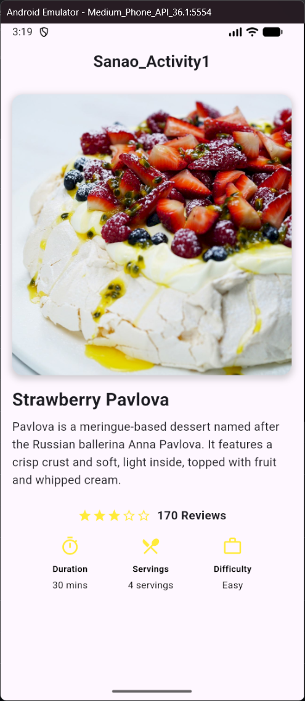

# cce106_pavlova_sanao

A Flutter project that creates a simple pavlova recipe activity.

## Overview

This project is part of the CCE106 course activity, designed to build a mobile app screen showcasing a "Strawberry Pavlova" recipe. The app displays an image of the dessert, along with details such as description, ratings, duration, servings, and difficulty level.

## Screenshots

